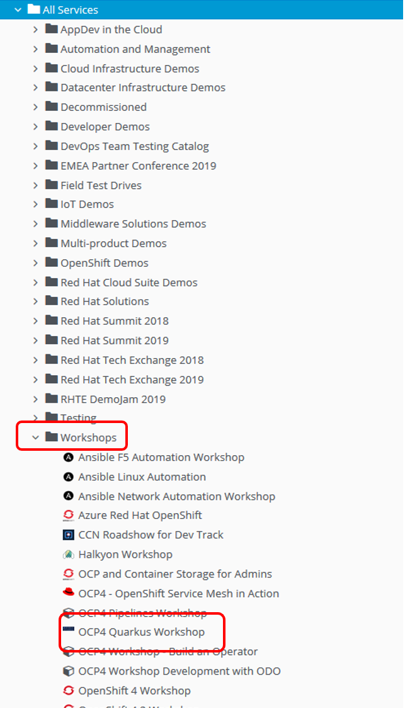
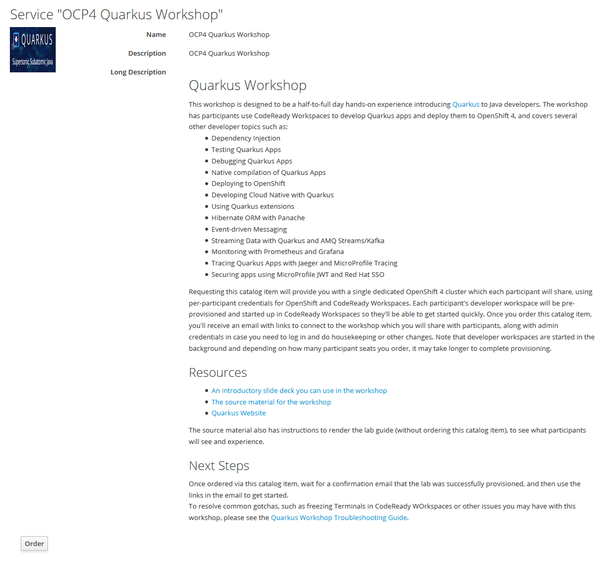
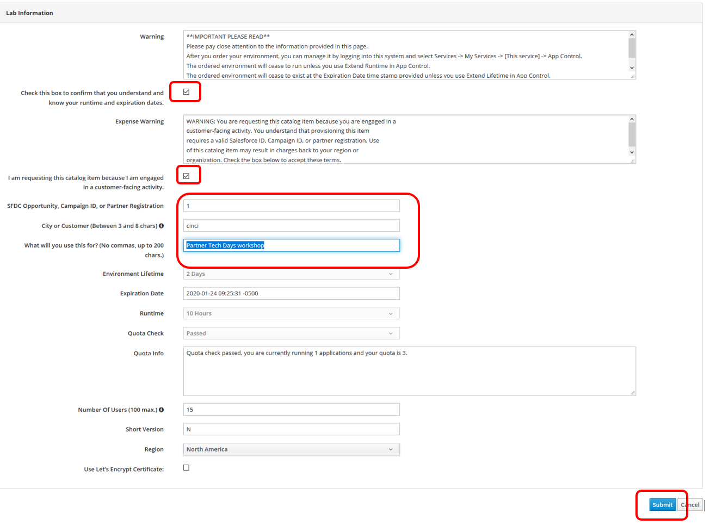

How To Provision the Quarkus Environment
~~~~~~~~~~~~~~~~~~~~~~~~~~~~~~~~~~~~~~~~

The following instructions provide quidance on how to provision the environment used to conduct the Quarkus/Openshift workshops.

*Step 1.* Login to your account on link:https://rhpds.redhat.com[Red Hat Product Demo System(RHPDS)^]

*Step 2.* Use the *Services* menu on the left and navigate to *Services->Catalogs*.

*Step 3.* Locate the *Workshops->OCP Quarkus Workshop* workshop and select it.

*Step 4.* Click on the *Order* button to initiate the ordering prcess.

*Step 5.* Populate the fields identified on the screenshot below, then click the *Submit* button.

*Step 6.*  Wait for the confirmation email that conveys the environment has been created.  Once the email is received, update the *README.adoc* file located in the *environments* folder to reflect the appropriate information for the city you are provisioning.