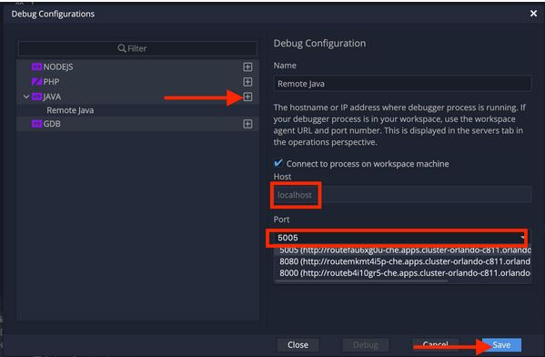
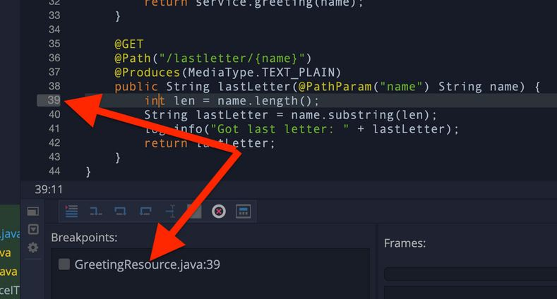
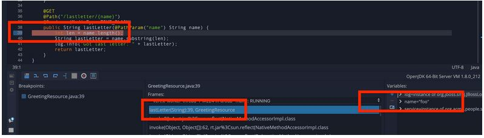

*Debugging Quarkus Apps*
~~~~~~~~~~~~~~~~~~~~~~~~

Debugging is an art of finding errors (bugs) and eradicating (debug) them from a piece of code written in any programming language. Quarkus apps are no different in this regard and you can use the raw Java command line debugger (*jdb*) or, if your IDE supports it, graphical debugging. Most IDEs have integration with Java debuggers, including Eclipse Che, so let's exercise it.

*Write some bad code*
~~~~~~~~~~~~~~~~~~~~~

Let's introduce a subtle off-by-one bug in our application and use the debugger to debug it.

Open up the *GreetingResource.java* class again, and add another RESTful endpoint that returns the last letter in a name:

....
    @GET
    @Path("/lastletter/{name}")
    @Produces(MediaType.TEXT_PLAIN)
    public String lastLetter(@PathParam("name") String name) {
        int len = name.length();
        String lastLetter = name.substring(len);
        log.info("Got last letter: " + lastLetter);
        return lastLetter;
    }
....

A a bug has been reported where the last letter is not working. To reproduce the bug, try to retrieve the last letter of the string Foo by running this in a Terminal (your app should still be running - if it is not, use Start Live Coding again):

....
curl http://localhost:8080/hello/lastletter/Foo
....

Due to the bug, nothing is returned. It should have given us back an *o*. You'll also see *Got last letter*: and then no letter.

You can probably spot the bug right away but let's see how you could find this with the debugger, and more importantly fix it and re-test very quickly.

*Attach debugger*
~~~~~~~~~~~~~~~~~

In *Live Coding* mode, Quarkus apps also listen for debugger connections on port *5005*. Your app should still be running.

To connect to the running app, use the *Run -> Edit Debug Configurations* menu command. In the dialog, Click the *+* button next to *JAVA* to create a new Java debug configuration. You can name it whatever you want, but keep the *localhost* field as-is and select port *5005* in the port selection field:

Click *Save* to save this configuration, and then click *Debug* to attach the debugger to our running Quarkus app. The debugger view will appear at the bottom of the screen with several small buttons used to start/stop execution, step into/over/out of code, and other operations.

You can switch between the debug pane and the Terminal panes using the small icons to the left of the debugger window:

image:images/switch_pain.jpg[switch_pain]

*Set a Breakpoint*
~~~~~~~~~~~~~~~~~~

To debug the app, let's step through our function that has the bug. In the left gutter of the code, where the line numbers are shown, click once on the line number next to *int len = name.length();* to set a breakpoint. The line number will be highlighted and the breakpoint will be registered in the debug pane:

[NOTE]
====
your line numbers may be different depending on where you placed this code in the file.
====

*Trigger the bug*
~~~~~~~~~~~~~~~~~

Now that we have a breakpoint, go back to Terminals with the Terminal button. In the Terminal issue the same curl command as before:

....
curl http://localhost:8080/hello/lastletter/foo
....

This time, the command will appear to hang as the breakpoint has been reached. The line where you set the breakpoint will be highlighted. Click the Debugger button to go back to the debugger, which has paused the execution at the breakpoint:

You will see three main sections of the debug view:
****
* Breakpoints - This lists the breakpoints you've set. Each Breakpoint can be further configured, or selectively disabled, by right-clicking on the breakpoint in the breakpoint list.
* Frames - This is an ordered list of stack frames showing the path through the code from the beginning of the thread to the current location in our code.
* Variables - Here you can see the value of local variables in the selected stack frame. In our code we have no local variables defined yet, but once we start stepping through the code, newly defined variables (like len) will appear here.
****

You can use the various buttons to step across code:

image:images/step_through_code.jpg[step_through_code]

Step over the current line by clicking *Step Over*. This will fully execute the current line, and advance to the next line in the code and stop again. (You could also step into methods for deeper debugging).

At this point, *len* is defined (and listed on the right side):

image:images/len.png[len]

Click *Step Over* again, which executes the line to grab the last letter using *len* an offset to the *substring* method. See the bug? Look at the value of *lastLetter* in the variables list on the right - it's empty!

We need to pass an offset that is one before the end, to get the last letter.

Click the *Resume* button to let the method continue, log the erroneous value to the console, and return the value (your *curl* command has probably timed out by now).

*Fix the bug*
~~~~~~~~~~~~~

Fix the code by changing the line that calls *substring()* to read:
....
        String lastLetter = name.substring(len - 1);
....

With the bug fixed, re-trigger the method by running the *curl* command again in a Terminal:
....
curl http://localhost:8080/hello/lastletter/foo
....

The breakpoint will be hit once again. Step over the lines to verify the value of *lastLetter* is correct and you see a proper *Got last letter: o* on the console. before the method returns. You've fixed the bug!

[NOTE]
====
Occasionally the debugger gets disconnected from the running app. If your breakpoints aren't being hit, try to click the End Debug Session button, and then use the Run > Debug > Debug 'Remote Java' menu command to re-connect the debugger, and re-trigger the code.
====

Remove the breakpoint by clicking on the line number again to de-highlight it. Run the *curl* command once more to see the full bugfix which should return the last letter of the generated name now: You should see *o*.

Click *End Debug Session* button to quit the debugging session.

*Congratulations!*
~~~~~~~~~~~~~~~~~~

Quarkus apps are just like any other Java app, so debugging is straightforward and supported by many IDEs and CLIs out there. Combined with Live Reload, it makes development quick and (relatively) painless!

link:1_3_Building_Native_Quarkus_apps.adoc[*NEXT LAB -> Building Native Quarkus apps*]