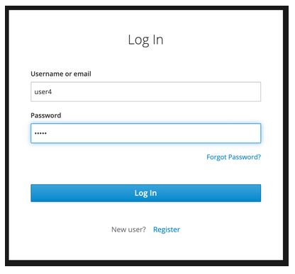
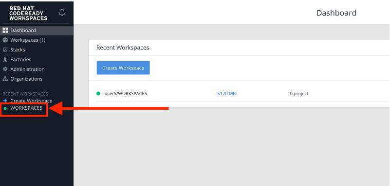
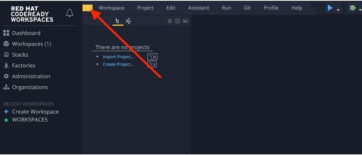

*OVERVIEW*
~~~~~~~~~~~

Quarkus is a Kubernetes Native Java stack tailored for GraalVM & OpenJDK HotSpot, crafted from the best of breed Java libraries and standards. Amazingly fast boot time, incredibly low RSS memory (not just heap size!) offering near instant scale up and high density memory utilization in container orchestration platforms like Kubernetes. Quarkus uses a technique called compile time boot and offers a unified imperative and reactive programming model and a number of other developer features like Live Reload to bring _real joy to your development.

Throughout this lab you'll discover how Quarkus can make your development of cloud native apps faster and more productive.

*TARGET AUDIENCE*
~~~~~~~~~~~~~~~~~
This workshop is recommended for developers, operations and technical leaders who are interested in learning more about the benefits of using the OpenShift Container Platform and Quarkus.

*Access Your Development Environment*
~~~~~~~~~~~~~~~~~~~~~~~~~~~~~~~~~~~~~

You will be using Red Hat CodeReady Workspaces, an online IDE based on Eclipe Che. *Changes to files are auto-saved every few seconds*, so you don't need to explicitly save changes.

To get started, view the following page and find the Code Ready Console for the workshop you are attending.  *Login* to that environments using the credentials conveyed on the *Lab Environments* page.

link:../environments/README.adoc[*Lab Environments*^]

Once you log in, you'll be placed on your personal dashboard. We've pre-created workspaces for you to use. Click on the name of the pre-created workspace on the left, as shown below (the name will be different depending on your assigned number). You can also click on the name of the workspace in the center, and then click on the green button that says "OPEN" on the top right hand side of the screen:

After a minute or two, you'll be placed in the workspace:

image:images/workspace.jpg[workspace]

Users of Eclipse, IntelliJ IDEA or Visual Studio Code will see a familiar layout: a project/file browser on the left, a code editor on the right, and a terminal at the bottom. You'll use all of these during the course of this workshop, so keep this browser tab open throughout. *If things get weird, you can simply reload the browser tab to refresh the view*.

To gain extra screen space, click on the yellow arrow to hide the left menu (you won’t need it):

link:1_Getting_Started_with_Quarkus.adoc[*LAB -> Getting Started with Quarkus*]