# Operator-driven installation troubleshooting

From the **Status** column of the **rhpam-trial-kieserver** and **rhpam-trial-rhpamcentr** deployment configs, it appears that the Deployment Configs that are responsible for rolling out the necessary pods are unable to create the necessary pods for the installation. The number of pods for both deployment configs continues staying at “0 of 1” and the installation is not proceeding.

1. Navigate to **Workloads** -> **Pods** and click on the *business-automation-operator-...* pod.

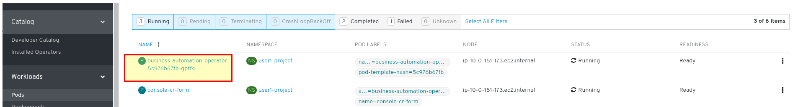

2. Click on the **Logs** tab and observe the logs entries.

```json
$ oc logs business-automation-operator-b76dd6478-8rdwq
....
{"level":"info","ts":1576054074.2177753,"logger":"olm","msg":"Found deployments with status ","stopped":["rhpam-trial-kieserver","rhpam-trial-rhpamcentr"],"starting":[],"ready":[]}
{"level":"warn","ts":"2019-12-11T08:56:12.898941522Z","logger":"kieapp.controller","msg":"ImageStreamTag openshift/rhpam-businesscentral-rhel8:7.5.1 doesn't exist."}
{"level":"info","ts":"2019-12-11T08:56:12.898992875Z","logger":"kieapp.controller","msg":"Creating","kind":"ImageStreamTag","name":"rhpam-businesscentral-rhel8:7.5.1","from":"registry.redhat.io/rhpam-7/rhpam-businesscentral-rhel8:7.5.1","namespace":"pam-dm1"}
{"level":"warn","ts":"2019-12-11T08:56:12.925660605Z","logger":"kieapp.controller","msg":"ImageStreamTag openshift/rhpam-kieserver-rhel8:7.5.1 doesn't exist."}
{"level":"info","ts":"2019-12-11T08:56:12.925704094Z","logger":"kieapp.controller","msg":"Creating","kind":"ImageStreamTag","name":"rhpam-kieserver-rhel8:7.5.1","from":"registry.redhat.io/rhpam-7/rhpam-kieserver-rhel8:7.5.1","namespace":"pam-dm1"}
{"level":"info","ts":1576054572.9361641,"logger":"olm","msg":"Found deployments with status ","stopped":["rhpam-trial-kieserver","rhpam-trial-rhpamcentr"],"starting":[],"ready":[]}
{"level":"warn","ts":"2019-12-11T08:59:34.841821335Z","logger":"kieapp.controller","msg":"ImageStreamTag openshift/rhpam-businesscentral-rhel8:7.5.1 doesn't exist."}
{"level":"info","ts":"2019-12-11T08:59:34.841874957Z","logger":"kieapp.controller","msg":"Creating","kind":"ImageStreamTag","name":"rhpam-businesscentral-rhel8:7.5.1","from":"registry.redhat.io/rhpam-7/rhpam-businesscentral-rhel8:7.5.1","namespace":"pam-dm1"}
{"level":"warn","ts":"2019-12-11T08:59:34.864665726Z","logger":"kieapp.controller","msg":"ImageStreamTag openshift/rhpam-kieserver-rhel8:7.5.1 doesn't exist."}
{"level":"info","ts":"2019-12-11T08:59:34.864706887Z","logger":"kieapp.controller","msg":"Creating","kind":"ImageStreamTag","name":"rhpam-kieserver-rhel8:7.5.1","from":"registry.redhat.io/rhpam-7/rhpam-kieserver-rhel8:7.5.1","namespace":"pam-dm1"}
{"level":"info","ts":1576054774.8772945,"logger":"olm","msg":"Found deployments with status ","stopped":["rhpam-trial-kieserver","rhpam-trial-rhpamcentr"],"starting":[],"ready":[]}
.......
```
Pay attention to the **warn** level entries - they indicate that there an ImageStreamTag doesn't exist !! So, that's a clue that we will investigate more deeply in a minute.

3. Another useful area to investigate in a project when something is not looking right is the **Home** -> **Events**. Click on the second dropdown (typically showing **All Categories** by default and choose **Error** from the dropdown). The events don't seem to be helping us figure out what the problem is.

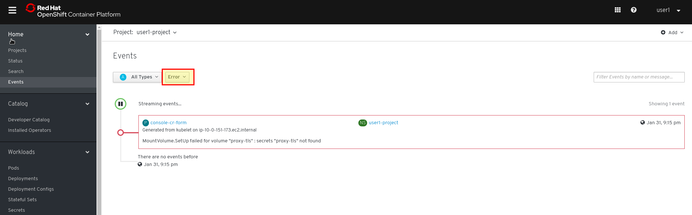

4. Another thing to try is to see if we can roll out the latest deployment config. Navigate to **Workloads** -> **Deployment Configs**, click on the *rhpam-trial-kieserver* Deployment Config, and from the **Actions** dropdown in the upper right corner attempt to **Start Rollout**

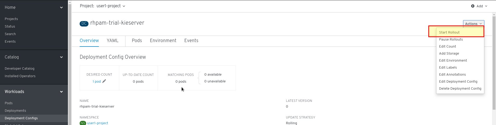

Triggering that action gives us a very actionable and meaningful error message - if the Deployment Config is unable to find the container images that it needs to run, it makes sense that our Pods are unable to create the container they need !

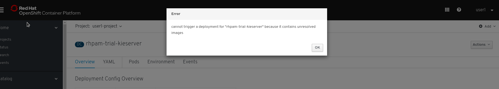

5. Finally, we can investigate the ImageStream that we saw some warnings about a bit earlier. Navigate to **Builds** -> **Image Streams** from the main menu, and click on the *rhpam-kieserver-rhel8* ImageStream.

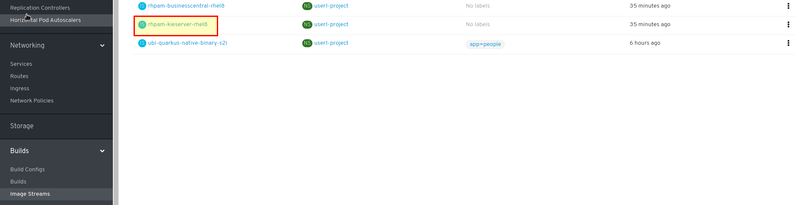

6. The details of this image stream give us some additional information that we need to understand the issue at hand. The **Last Updated** element at the bottom right shows us that the 7.6.0 tag  was never pulled, and now we know the exact image that the ImageStream is trying to load, etc.

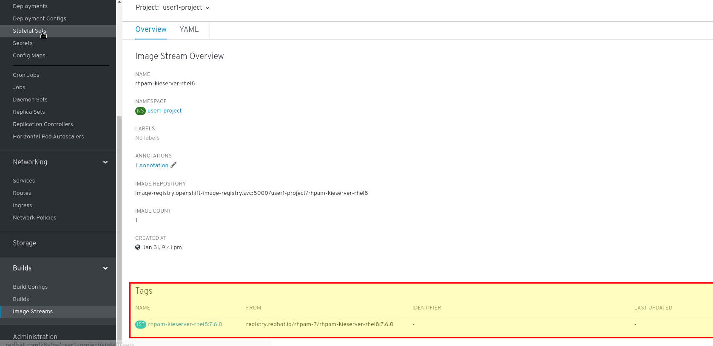

The same information is available in the *rhpam-businesscentral-rhel8* image stream.

If we look at the **YAML** tab of the ImageStream details, that gives the most actionable information

```yaml
kind: ImageStream
apiVersion: image.openshift.io/v1
metadata:
  name: rhpam-businesscentral-rhel8
  namespace: user1-project
  selfLink: >-
    /apis/image.openshift.io/v1/namespaces/user1-project/imagestreams/rhpam-businesscentral-rhel8
  uid: 486ad570-449c-11ea-bc55-0a580a81001b
  resourceVersion: '149062'
  generation: 2
  creationTimestamp: '2020-02-01T02:41:00Z'
  annotations:
    openshift.io/image.dockerRepositoryCheck: '2020-02-01T02:41:01Z'
spec:
  lookupPolicy:
    local: false
  tags:
    - name: 7.6.0
      annotations: null
      from:
        kind: DockerImage
        name: 'registry.redhat.io/rhpam-7/rhpam-businesscentral-rhel8:7.6.0'
      generation: 2
      importPolicy: {}
      referencePolicy:
        type: Local
status:
  dockerImageRepository: >-
    image-registry.openshift-image-registry.svc:5000/user1-project/rhpam-businesscentral-rhel8
  tags:
    - tag: 7.6.0
      items: null
      conditions:
        - type: ImportSuccess
          status: 'False'
          lastTransitionTime: '2020-02-01T02:41:01Z'
          reason: InternalError
          message: >-
            Internal error occurred: Get
            https://registry.redhat.io/v2/rhpam-7/rhpam-businesscentral-rhel8/manifests/7.6.0:
            unauthorized: Please login to the Red Hat Registry using your
            Customer Portal credentials. Further instructions can be found here:
            https://access.redhat.com/RegistryAuthentication
          generation: 2

```

So, what is going wrong here ? Based on the error messages so far, we can conclude that  when cluster attempts to pull down the kieserver and Business Central container images from the image registry (registry.redhat.io), it is unable to authenticate to the container registry. The reason for that is that the Red Hat container registry is available to authenticated users only, and the custom resource (or the operator) does not have those credentials.


# Fixing the Operator Issue

In order to fix this issue we will need an account that can authenticate with the image registry and pull images. We need to configure that account in our project

1. Navigate to https://access.redhat.com/terms-based-registry/ , log in with your Red Hat account  and proceed to create a new Service Account.

**NOTE** : If you don't have a Red Hat account through your company, you can click the "Register" link and register for a developer account using your personal email address.

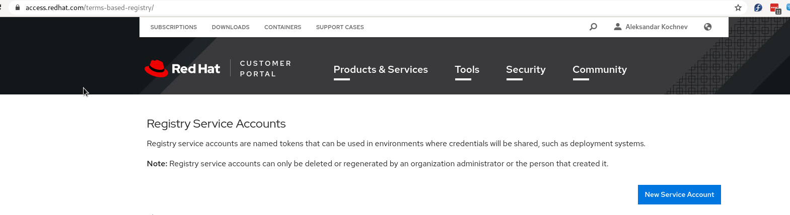

Since this authentication information will be stored in an OpenShift secret that it will use to pull from the registry, it is best practice to use a service account for this purpose. You really wouldn't want to put in your personal Red Hat account authentication information in an OpenShift secret.

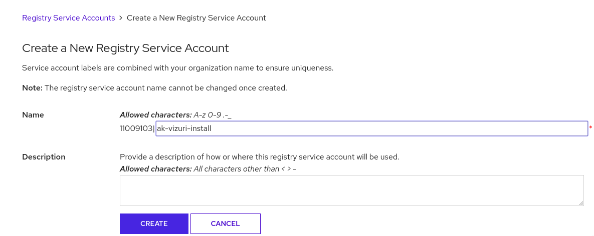

2. This process generates a weirdly looking username (e.g. “11009103|userNN-pam-dm1-install“ in my case) and a token for authentication.

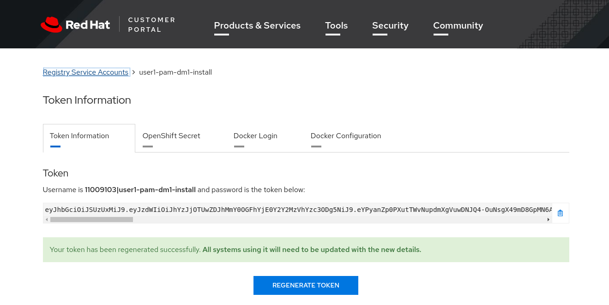


3. Run the command below to create the secret in OpenShift, substituting the token as the value for the **docker-password** parameter, your correct username (e.g. replaces userNN below with your actual username) and your email ( you might want to create this command in a text window first to get all the values right). In short, this gives OpenShift the authentication information it needs when it tries to pull from the registry specified in the **docker-server** parameter

```bash
oc create secret docker-registry userNN-pamdm1-rhreg-secret --docker-server=registry.redhat.io --docker-username="99999|your-service-account-changeme" --docker-password="eyJh.....snipped...JuzTo0" --docker-email="your-email@yourdomain.com"
```
**NOTE** : Technically, if your workstation is properly setup with the **oc** command line tool, you could go to the **OpenShift Secret** tab and download the secret for a slightly easier creation of the secret. However, since we're running all of this in the CodeReady Workspaces terminal, we will just run the commands on the terminal to create the secret

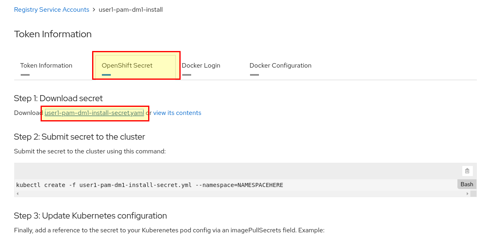

4. Add the secret to the default service account in your project so that it can use this secret for pulling from the registry (replaces **userNN** with your own username)

```bash
oc secrets link default userNN-pamdm1-rhreg-secret --for=pull
```

5. Now, re-import the images on the command line by running the (two) following commands:

```bash
oc import-image rhpam-businesscentral-rhel8 --from=registry.redhat.io/rhpam-7/rhpam-businesscentral-rhel8 --all --confirm

imagestream.image.openshift.io/rhpam-businesscentral-rhel8 imported

Name:			rhpam-businesscentral-rhel8
Namespace:		pam-dm1
Created:		41 minutes ago
Labels:			<none>
Annotations:		openshift.io/image.dockerRepositoryCheck=2019-12-11T09:29:26Z
Image Repository:	image-registry.openshift-image-registry.svc:5000/pam-dm1/rhpam-businesscentral-rhel8
Image Lookup:		local=false
....  Snipped ...
```

```bash
$ oc import-image rhpam-kieserver-rhel8 --from=registry.redhat.io/rhpam-7/rhpam-kieserver-rhel8 --all --confirm

imagestream.image.openshift.io/rhpam-kieserver-rhel8 imported

Name:			rhpam-kieserver-rhel8
Namespace:		pam-dm1
Created:		44 minutes ago
Labels:			<none>
Annotations:		openshift.io/image.dockerRepositoryCheck=2019-12-11T09:29:08Z
Image Repository:	image-registry.openshift-image-registry.svc:5000/pam-dm1/rhpam-kieserver-rhel8
Image Lookup:		local=false
Unique Images:		1
Tags:			2
… snipped …

```

6. Investigate the ImageStream details - now you can see that the ImageStream for **rhpam-kieserver-rhel8** ( by navigating to **Builds** -> **ImageStreams** -> **rhpam-kieserver-rhel8** ) now has many tags successfully updated

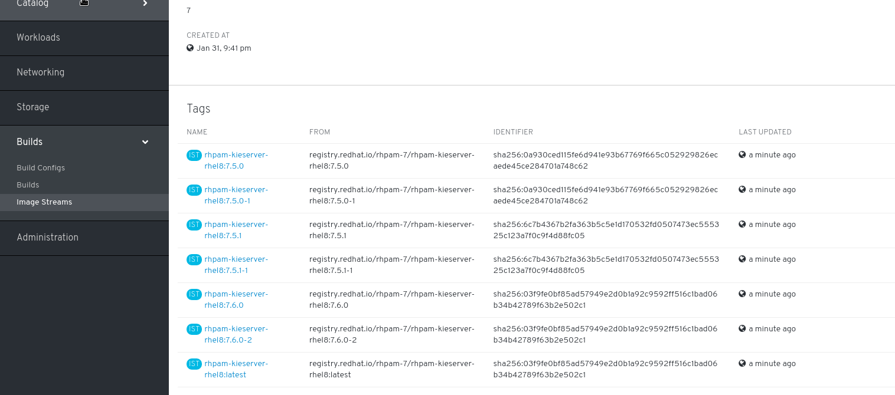

7. Now, if you go look at the pods, the products are happily spinning up pods and working :

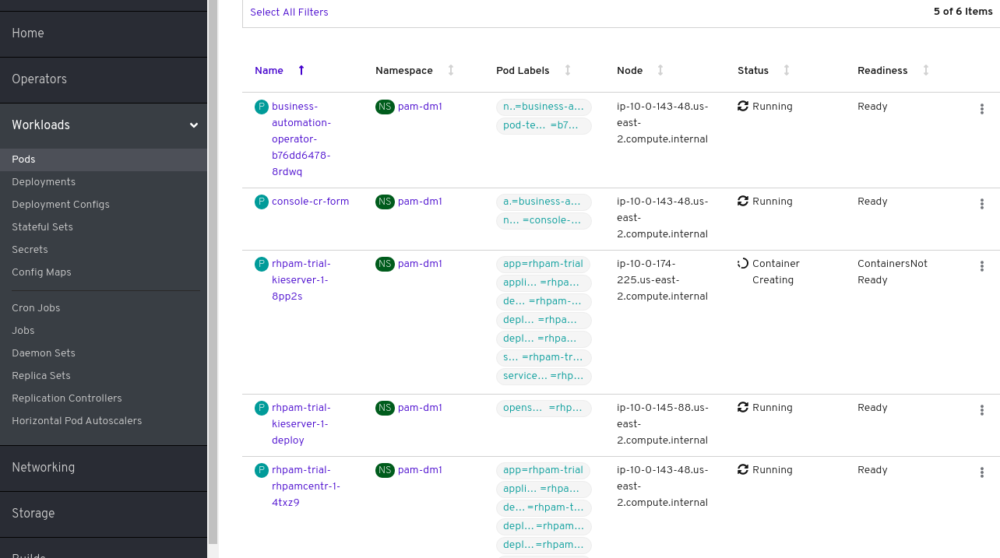

Wait until all pods in the project (**Workloads** -> **Pods**) are in a Running Status and a **Ready** State before proceeding to the next lab

Now, had we carefully looked at the  [Product documentation for PAM/DM](https://access.redhat.com/documentation/en-us/red_hat_process_automation_manager/7.5/html/deploying_a_red_hat_process_automation_manager_environment_on_red_hat_openshift_container_platform_using_operators/dm-openshift-prepare-con#registry-authentication-proc), we would have seen all of these prerequisite steps to installing the product, without having to troubleshoot it. Yet, in the world of OpenShift 4, a large portion of the system functionality is provided by operators and as a result, it is extremely important to have a good understanding of how to troubleshoot them. In the end, Operators are just a running pod on the platform, so we can use the same troubleshooting steps to investigate any issues on the platform.


[**NEXT LAB -> DMN Decision Service**](2_3_DMN_Decision_Service.md)


