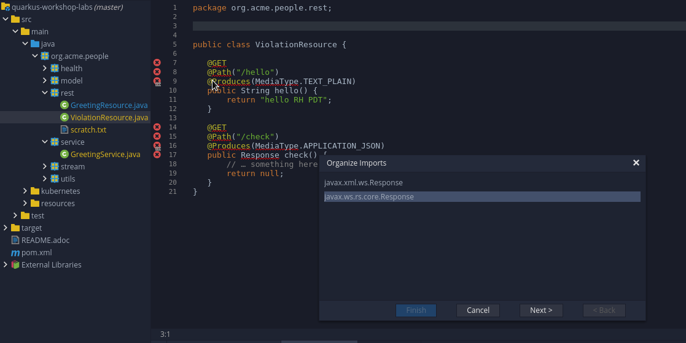
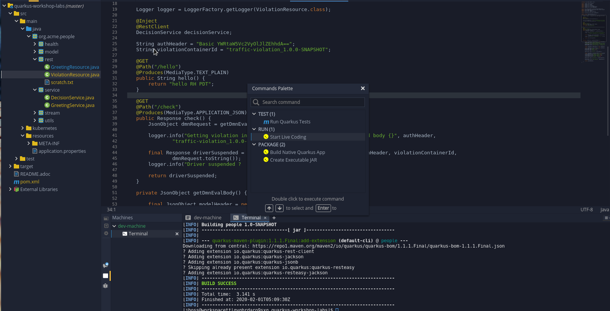

## Extend Quarkus app to delegate to decision service with the Microprofile REST client

In this lab, we will wrap the REST API exposed by Decision Manager (which is admittedly, nontrivial) in a much simpler REST API from our Quarkus app, that is much easier to use.

1. Create a ViolationResource class in the rest package that looks like this

```java
@Path("/violation")
public class ViolationResource {

   @GET
   @Path("/hello")
   @Produces(MediaType.TEXT_PLAIN)
   public String hello() {
       return "hello RH PDT";
   }

   @GET
   @Path("/check")
   @Produces(MediaType.APPLICATION_JSON)
   public Response check() {
       // … something here
       return null;
   }
}

```

Click on Assistant -> Organize imports to get the necessary jaxrs imports (use the imports from javax.ws.rs in the wizard)



2. Let’s add the Microprofile HTTP client service (based on https://quarkus.io/guides/rest-client and https://download.eclipse.org/microprofile/microprofile-rest-client-1.2.1/microprofile-rest-client-1.2.1.html). Technically, we could manually edit the pom.xml file and add all the necessary maven dependencies, but the Quarkus Maven plugin has a convenient command. The command below adds the necessary dependencies in our project so that we can create our service that will call into the Decision Manager REST API. Run the following command from /projects/quarkus-workshop-labs

```bash
mvn quarkus:add-extension -Dextensions="rest-client, quarkus-jackson, quarkus-resteasy-jackson, quarkus-jsonb"
```

3. Because we want to lean on the MicroProfile REST client, we will add a very simple service interface and annotate it appropriately (inside of org.acme.people.service package). Create a DecisionService class in the service package that looks like this:

```java
package org.acme.people.service;

import org.eclipse.microprofile.rest.client.inject.RegisterRestClient;
import javax.ws.rs.HeaderParam;
import javax.ws.rs.POST;
import javax.ws.rs.Path;
import javax.ws.rs.Produces;
import javax.ws.rs.core.Response;
import javax.ws.rs.Consumes;

@RegisterRestClient
@Produces("application/json")
@Consumes("application/json")
public interface DecisionService {

   @POST
   @Path("/services/rest/server/containers/{containerId}/dmn")
   Response checkDriverSuspended(
       @HeaderParam("Authorization") String authorization,
       @javax.ws.rs.PathParam("containerId") String containerId,
       String requestBody) ;
}

```

In short, the Microprofile REST client will inspect this service interface and will create an implementation that matches the desired behavior specified by the Annotations below :
* Call the URL indicated by the @Path annotation
* **@Produces** and **@Consumes**: It will consume and produce JSON
* **@HeaderParam**: It will take an **authorization** parameter as a method argument and put it in the header of the request to the kieserver.
   * It will also take a **containerId** parameter which will be used to reach the right path.
   * The @Path annotation references the relative path to the DMN service that we deployed in Decision Manager
* **@POST**:  the request body would be POST-ed to destination URL

4. Update the *src/main/resources/application.properties* property file by adding the base URL that will be invoked for the DecisionService implementation (note that for this case I’m pointing it to the http route to the kieserver, not the https as the https route will need to deal with the self signed certificate). For the /mp-rest/url property, copy the URL of the *rhpam-trial-kieserver-http* route (if you use the https route, you will have to deal with the self signed certificate error, which we will skip for now)

  _`org.acme.people.service.DecisionService/mp-rest/url=http://rhpam-trial-kieserver-http-userNN-project.apps.<your-cluster-base-url>/`_

  _`org.acme.people.service.DecisionService/mp-rest/scope=javax.inject.Singleton`_


5. Inject the Decision Service in our REST resource (ViolationResource) and lean on it to call the kieserver (only showing the changes here).

**NOTE**: Temporarily add couple of String values for the **authHeader** and **violationContainerId** parameters (to be dealt with a bit further down)

```java
   Logger logger = LoggerFactory.getLogger(ViolationResource.class);

   @Inject
   @RestClient
   DecisionService decisionService;

   String authHeader = "Basic YWRtaW5Vc2VyOlJlZEhhdA==";
   String violationContainerId = "traffic-violation_1.0.0-SNAPSHOT";

   @GET
   @Path("/check")
   @Produces(MediaType.APPLICATION_JSON)
   public Response check() {
       JsonObject dmnRequest = getDmnEvalBody();

       logger.info("Getting violation info with authHeaders {}, container {}, and body {}", authHeader,
               violationContainerId, dmnRequest.toString());

       final Response driverSuspended = decisionService.checkDriverSuspended(authHeader, violationContainerId,
               dmnRequest.toString());
       logger.info("Driver suspended ?  {}", driverSuspended);

       return driverSuspended;
   }

```

6. Finally, implement the utility method that builds our JSON body that kieserver needs to evaluate the DMN **(be sure to replace the token value of <your-model-namespace-from-lab3> with the actual value you got in  your DMN service)**

```java
private JsonObject getDmnEvalBody() {

       final JsonObject modelHeader = new JsonObject();
       modelHeader.put("model-namespace",
       "https://github.com/kiegroup/drools/kie-dmn/<your-model-namespace-from-lab3>");
       modelHeader.put("model-name", "Traffic Violation");
       modelHeader.put("decision-name", "Should the driver be suspended?");

       final JsonObject dmnContext = new JsonObject();

       final JsonObject driverInfo = new JsonObject();
       driverInfo.put("Name", "Bob");
       driverInfo.put("Age", 23);
       driverInfo.put("Points", 2);

       dmnContext.put("Driver", driverInfo);

       final JsonObject violationInfo = new JsonObject();
       violationInfo.put("Code", "speed-stop");
       violationInfo.put("Speed Limit", 30);
       violationInfo.put("Actual Speed", 45);
       violationInfo.put("Type", "speed");

       dmnContext.put("Violation", violationInfo);

       modelHeader.put("dmn-context", dmnContext);

       return modelHeader;
   }

```

Once again, click on **Assistant**->**Organize Imports**. Use the vertx JsonObject, the SLF4j Logger and SLF4j LoggerFactory classes

7. Now, we're ready to see our service in action. Go to the **Commands Pallette** and choose **Start Live Coding**



... alternatively, you could just run this on the command line ..

```bash
mvn clean package quarkus:dev -DskipTests
[INFO] Scanning for projects...
[INFO]
.... Snipped ....
Listening for transport dt_socket at address: 5005
2019-12-11 06:40:58,132 INFO  [io.quarkus] (main) Quarkus 1.0.1.Final started in 1.333s. Listening on: http://0.0.0.0:8080
2019-12-11 06:40:58,134 INFO  [io.quarkus] (main) Profile dev activated. Live Coding activated.
2019-12-11 06:40:58,135 INFO  [io.quarkus] (main) Installed features: [cdi, rest-client, resteasy, resteasy-jackson, vertx, vertx-web]
2019-12-11 06:41:45,708 INFO  [org.acm.ViolationResource] (vert.x-worker-thread-3) Getting violation info with authHeaders Basic YWRtaW5Vc2VyOlJlZEhhdA==, container traffic-violation_1.0.0-SNAPSHOT, and body {"model-namespace":"https://github.com/kiegroup/drools/kie-dmn/_A4BCA8B8-CF08-433F-93B2-A2598F19ECFF","model-name":"Traffic Violation","decision-name":"Should the driver be suspended?","dmn-context":{"Driver":{"Name":"Bob","Age":23,"Points":2},"Violation":{"Code":"speed-stop","Speed Limit":30,"Actual Speed":45}}}
2019-12-11 06:41:45,847 INFO  [org.acm.ViolationResource] (vert.x-worker-thread-3) Driver suspended ?  org.jboss.resteasy.client.jaxrs.engines.URLConnectionEngine$1@692bfb5e
```

8. Now, on the terminal, let's execute the new Quarkus REST API endpoint

```bash
curl http://localhost:8080/violation/check
```

The response from our Quarkus Service comes back the same as from our swagger UI:

```json
{
  "type" : "SUCCESS",
  "msg" : "OK from container 'traffic-violation_1.0.0-SNAPSHOT'",
  "result" : {
    "dmn-evaluation-result" : {
      "messages" : [ ],
      "model-namespace" : "https://github.com/kiegroup/drools/kie-dmn/_A4BCA8B8-CF08-433F-93B2-A2598F19ECFF",
      "model-name" : "Traffic Violation",
      "decision-name" : "Should the driver be suspended?",
      "dmn-context" : {
        "Violation" : {
          "Type" : "speed",
          "Speed Limit" : 30,
          "Actual Speed" : 45,
          "Code" : "speed-stop"
        },
        "Driver" : {
          "Points" : 2,
          "Age" : 23,
          "Name" : "Bob"
        },
        "Fine" : {
          "Points" : 3,
          "Amount" : 500
        },
        "Should the driver be suspended?" : "No"
      },
      "decision-results" : {
        "_4055D956-1C47-479C-B3F4-BAEB61F1C929" : {
          "messages" : [ ],
          "decision-id" : "_4055D956-1C47-479C-B3F4-BAEB61F1C929",
          "decision-name" : "Fine",
          "result" : {
            "Points" : 3,
            "Amount" : 500
          },
          "status" : "SUCCEEDED"
        },
        "_8A408366-D8E9-4626-ABF3-5F69AA01F880" : {
          "messages" : [ ],
          "decision-id" : "_8A408366-D8E9-4626-ABF3-5F69AA01F880",
          "decision-name" : "Should the driver be suspended?",
          "result" : "No",
          "status" : "SUCCEEDED"
        }
      }
    }
  }
}
```

9. Now that we have something working, we can do just a tiny bit of cleanup : we will move two of the static properties into configuration, as they really shouldn’t be hardcoded strings in the resource (granted, there might be more static strings that could be moved into the properties file, but this start illustrates how it works):

* Add **@Configuration** annotations in the resource and move the actual configuration values into *application.properties*

```java
   @ConfigProperty(name = "basic.authHeader")
   String authHeader;

   @ConfigProperty(name = "violation.containerId")
   String violationContainerId;

```

```properties
basic.authHeader=Basic YWRtaW5Vc2VyOlJlZEhhdA==
violation.containerId=traffic-violation_1.0.0-SNAPSHOT
```

Now, re-run **Assistant** -> **Fix Imports** to get the correct **@ConfigProperty** imports


* Change the signature of the utility **getDmnEvalBody** method to allow for more flexibility with the data used to call the *kieserver* REST API. Then, add **QueryParams** for the values to the REST API so that the ViolationResource users can specify additional query parameters for **age**, **points** , and **actualSpeed**.
*

```java
public Response check(
           @QueryParam("age") int age,
           @QueryParam("points") int points,
           @QueryParam("actualSpeed") int actualSpeed) {
       final JsonObject dmnRequest = getDmnEvalBody(age,points,actualSpeed);
….
}

private JsonObject getDmnEvalBody(final int age, final int points, final int actualSpeed) {
  /// don’t forget to pass these parameters into the driver info and violationInfo  objects, eg.
      // ... snipped
       driverInfo.put("Age", age);
       driverInfo.put("Points", points);
      // ... snipped ... /
       violationInfo.put("Actual Speed", actualSpeed);
}

```

Finally, just as before, don't forget to run **Assistant** -> **Organize Imports** to sort out any missing imports.

10. Now, I can run violation checks through my new API directly using URL params from the command line :

( note that I put the URL in quotes, otherwise bash process the '&' as a separate command)
```bash
$ curl "http://localhost:8080/violation/check?age=35&points=3&actualSpeed=55"
{
  "type" : "SUCCESS",
  "msg" : "OK from container 'traffic-violation_1.0.0-SNAPSHOT'",
  "result" : {
    "dmn-evaluation-result" : {
      "messages" : [ {
        "dmn-message-severity" : "WARN",
        "message" : "No rule matched for decision table 'Fine' and no default values were defined. Setting result to null.",
        "message-type" : "FEEL_EVALUATION_ERROR",
        "source-id" : "_4055D956-1C47-479C-B3F4-BAEB61F1C929"
      } ],
      "model-namespace" : "https://github.com/kiegroup/drools/kie-dmn/_A4BCA8B8-CF08-433F-93B2-A2598F19ECFF",
      "model-name" : "Traffic Violation",
      "decision-name" : "Should the driver be suspended?",
      "dmn-context" : {
        "Violation" : {
          "Speed Limit" : 30,
          "Actual Speed" : 55,
          "Code" : "speed-stop"
        },
        "Driver" : {
          "Points" : 3,
          "Age" : 35,
          "Name" : "Bob"
        },
        "Fine" : null,
        "Should the driver be suspended?" : "No"
      },
      "decision-results" : {
        "_4055D956-1C47-479C-B3F4-BAEB61F1C929" : {
          "messages" : [ ],
          "decision-id" : "_4055D956-1C47-479C-B3F4-BAEB61F1C929",
          "decision-name" : "Fine",
          "result" : null,
          "status" : "SUCCEEDED"
        },
        "_8A408366-D8E9-4626-ABF3-5F69AA01F880" : {
          "messages" : [ ],
          "decision-id" : "_8A408366-D8E9-4626-ABF3-5F69AA01F880",
          "decision-name" : "Should the driver be suspended?",
          "result" : "No",
          "status" : "SUCCEEDED"
        }
      }
    }
  }
}

Note that the response contains the information that we passed in query params as input to the DMN service (in the dmn-context element) - e.g. points, age, actual speed, etc.

```

# Package app and deploy to OpenShift
Now we have a working application that provides a simple interface to query violations. There are at least a few more things to clean up (for extra credit), but the app achieves most of its goals. Let’s deploy it.

1. Let's package the service as a native application - go to the **Commands Palette** -> **Build Native Quarkus App** or just run the maven command in a terminal directly

```bash
mvn clean package -Pnative -DskipTests
[INFO] Scanning for projects...
[INFO]
.... Snipped ....
[pamdm-quark1-1.0.0-SNAPSHOT-runner
[pamdm-quark1-1.0.0-SNAPSHOT-runner:427634]    classlist:   8,530.36 ms
[pamdm-quark1-1.0.0-SNAPSHOT-runner:427634]        (cap):   1,354.68 ms
[pamdm-quark1-1.0.0-SNAPSHOT-runner:427634]        setup:   3,227.08 ms
008:45,880 INFO  [org.jbo.threads] JBoss Threads version 3.0.0.Final
[pamdm-quark1-1.0.0-SNAPSHOT-runner:427634]   (typeflow):  22,544.91 ms
[pamdm-quark1-1.0.0-SNAPSHOT-runner:427634]    (objects):  13,944.58 ms
[pamdm-quark1-1.0.0-SNAPSHOT-runner:427634]   (features):     763.03 ms
[pamdm-quark1-1.0.0-SNAPSHOT-runner:427634]     analysis:  39,333.58 ms
[pamdm-quark1-1.0.0-SNAPSHOT-runner:427634]     (clinit):     838.09 ms
[pamdm-quark1-1.0.0-SNAPSHOT-runner:427634]     universe:   2,453.58 ms
[pamdm-quark1-1.0.0-SNAPSHOT-runner:427634]      (parse):   4,350.36 ms
[pamdm-quark1-1.0.0-SNAPSHOT-runner:427634]     (inline):   6,412.94 ms
[pamdm-quark1-1.0.0-SNAPSHOT-runner:427634]    (compile):  31,860.19 ms
[pamdm-quark1-1.0.0-SNAPSHOT-runner:427634]      compile:  45,217.52 ms
[pamdm-quark1-1.0.0-SNAPSHOT-runner:427634]        image:   3,268.57 ms
[pamdm-quark1-1.0.0-SNAPSHOT-runner:427634]        write:     649.52 ms
[pamdm-quark1-1.0.0-SNAPSHOT-runner:427634]      [total]: 103,103.97 ms
[INFO] [io.quarkus.deployment.QuarkusAugmentor] Quarkus augmentation completed in 105508ms
```

2. It does take a little while longer to finish packaging; however, now we have a natively compiled application that is small and blazingly fast. Inspect the executable and file sizes:

```bash

> ls -lh target/
total 42M
-rw-rw-r--. 1 akochnev akochnev 6.7K Dec 11 07:08 pamdm-quark1-1.0.0-SNAPSHOT.jar
drwxrwxr-x. 3 akochnev akochnev 4.0K Dec 11 07:10 pamdm-quark1-1.0.0-SNAPSHOT-native-image-source-jar
-rwxrwxr-x. 1 akochnev akochnev  41M Dec 11 07:10 pamdm-quark1-1.0.0-SNAPSHOT-runner

```

3. Let's trigger the build config using our new binaries and watch the app deploy to OpenShift


```bash
oc start-build people --from-file target/*-runner --follow
```
Wait for the build to complete, then watch OpenShift roll out the new version of the 'people' app. Once the old pod is terminated and the new pod is in "Running" state, hit the app route (and pass some parameters)
After running these commands, the native app is running on OpenShift :

```json
$ curl "http://people-userNN-project.apps.<your-base-cluster-url>/violation/check?age=38&points=4&actualSpeed=65"
{
  "type" : "SUCCESS",
  "msg" : "OK from container 'traffic-violation_1.0.0-SNAPSHOT'",
  "result" : {
    "dmn-evaluation-result" : {
      "messages" : [ {
        "dmn-message-severity" : "WARN",
        "message" : "No rule matched for decision table 'Fine' and no default values were defined. Setting result to null.",
        "message-type" : "FEEL_EVALUATION_ERROR",
        "source-id" : "_4055D956-1C47-479C-B3F4-BAEB61F1C929"
      } ],
      "model-namespace" : "https://github.com/kiegroup/drools/kie-dmn/_A4BCA8B8-CF08-433F-93B2-A2598F19ECFF",
      "model-name" : "Traffic Violation",
      "decision-name" : "Should the driver be suspended?",
      "dmn-context" : {
        "Violation" : {
          "Speed Limit" : 30,
          "Actual Speed" : 0,
          "Code" : "speed-stop"
        },
        "Driver" : {
          "Points" : 0,
          "Age" : 0,
          "Name" : "Bob"
        },
        "Fine" : null,
        "Should the driver be suspended?" : "No"
      },
      "decision-results" : {
        "_4055D956-1C47-479C-B3F4-BAEB61F1C929" : {
          "messages" : [ ],
          "decision-id" : "_4055D956-1C47-479C-B3F4-BAEB61F1C929",
          "decision-name" : "Fine",
          "result" : null,
          "status" : "SUCCEEDED"
        },
        "_8A408366-D8E9-4626-ABF3-5F69AA01F880" : {
          "messages" : [ ],
          "decision-id" : "_8A408366-D8E9-4626-ABF3-5F69AA01F880",
          "decision-name" : "Should the driver be suspended?",
          "result" : "No",
          "status" : "SUCCEEDED"
        }
      }
    }
  }
}
```

So, to summarize : we extended our Quarkus app to integrate with a Decision Service that was built using DMN and Decision Tables

**NOTE**:  The full source code for the Decision Manager integration on github at https://github.com/redhat-partner-tech/partner-tech-days-feb2020/tree/master/OpenShift-AppDev/labs/completed_project (if you run into issues with any of the piecemeal source code)

   `Congratulations, you just completed the integration of the Quarkus lab and the DMN Decision Service
`


