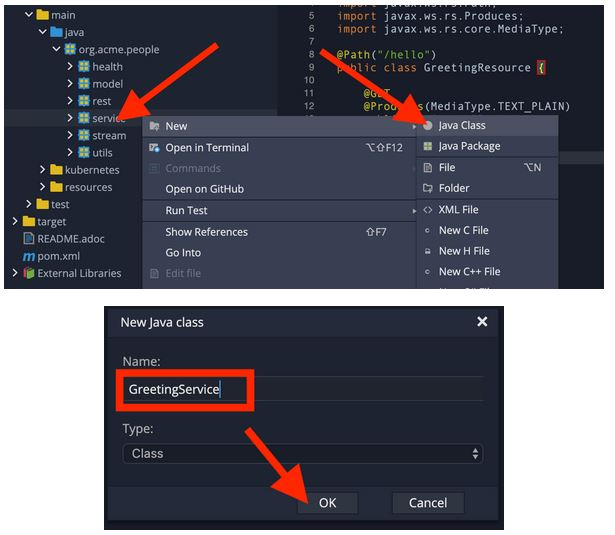
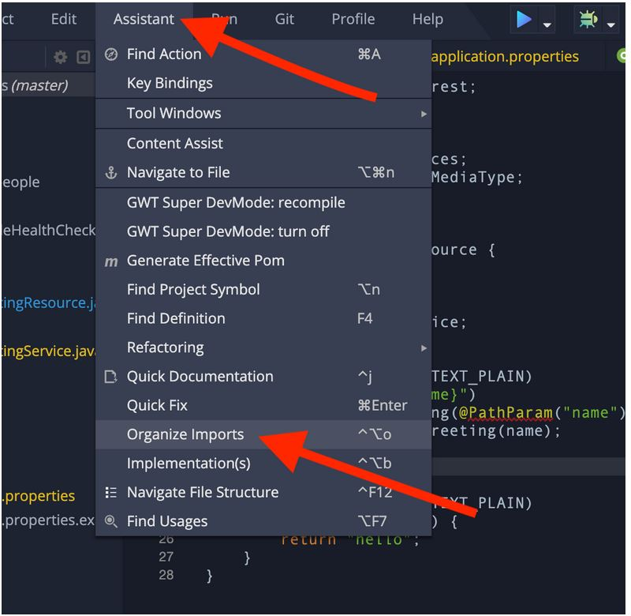
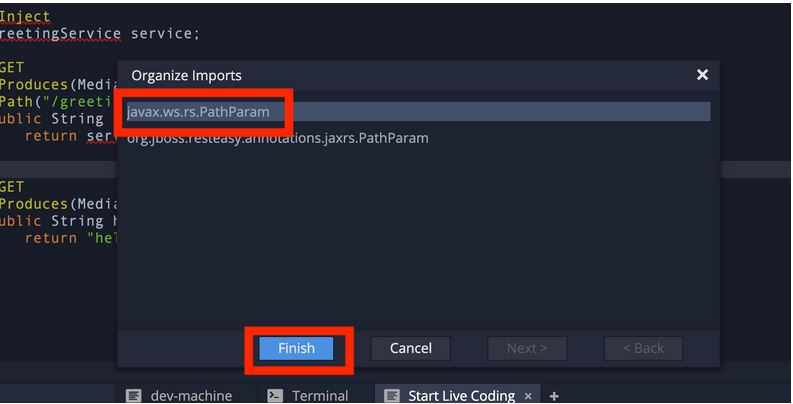

*Dependency Injection*
~~~~~~~~~~~~~~~~~~~~~~

In the previous step you created a basic RESTful Java application with Quarkus. In this step we'll add a custom bean using dependency injection (DI). Quarkus DI solution is based on the *Contexts and Dependency Injection for Java 2.0 specification*. Because of the dynamic nature of some CDI APIs which conflict with native compilation, only a subset of the CDI features are implemented - see also the *list* of supported features.

*Add Custom Bean*
~~~~~~~~~~~~~~~~~

Let's modify the application and add a companion bean. In CodeReady, right-click on the *org.acme.people.service* package in the project browser and select New --> Java Class. Name the class *GreetingService*.
newclass

Next, copy the below code into the class (remove the existing content before pasting in this code):

....
package org.acme.people.service;

import javax.enterprise.context.ApplicationScoped;

@ApplicationScoped
public class GreetingService {

    private String hostname = System.getenv().getOrDefault("HOSTNAME", "unknown");

    public String greeting(String name) {
        return "hello " + name + " from " + hostname;
    }

}
....

This is an injectable bean that implements a *greeting()* method returning a string *hello <hostname>* (where *<hostname>* is the Linux hostname of the machine on which the code runs).

Next, open the existing *GreetingResource.java* class file and add a new field and method above the existing *hello* method:

....
    @Inject
    GreetingService service;

    @GET
    @Produces(MediaType.TEXT_PLAIN)
    @Path("/greeting/{name}")
    public String greeting(@PathParam("name") String name) {
        return service.greeting(name);
    }
....

This will cause our new *GreetingResource* class to be instantiated and injected as the *service* field, and then the method *greeting* accesses this service to return the name.

You will get red error squigglies when you paste this code due to missing import statements:
error

image:images/greeting_service.jpg[greeting_service]

Use the *Assistant -> Organize Imports* menu option to fix this and import the right classes.

You may need to choose from multiple matches, e.g. make sure you choose to import *javax.ws.rs.PathParam* when fixing the missing *PathParam* import. In general, look for *javax* or other well-known names to import. If you get it wrong you'll find out soon enough.

[NOTE]
====
If you do not get red squigglies, or you can't make them disappear, try to close the file and re-open it, or reload your web browser. This is a known issue with Che on recent versions of Kubernetes.
====

*Inspect the results*
~~~~~~~~~~~~~~~~~~~~~

Check that it works as expected by loading the new endpoint using the same blue Preview URL and adding the */hello/greeting/quarkus* to the end of the URL, just as you did before.

Note we are exercising our new bean using the */hello/greeting/quarkus* endpoint, and you should see *hello quarkus from <hostname>*.

[NOTE]
====
In this case, the hostname is the hostname from the pod the app is running on within Kubernetes and will change later on.
====

*Congratulations!*
~~~~~~~~~~~~~~~~~~

It's a familiar CDI-based environment for you Enterprise Java developers out there, with powerful mechanisms to reload your code as you type (or very close to realtime). In the next step, we'll create some tests for our app, which should also be familiar to all developers.

link:1_2_Debugging_Quarkus_App.adoc[*NEXT LAB -> Debugging Quarkus App*]